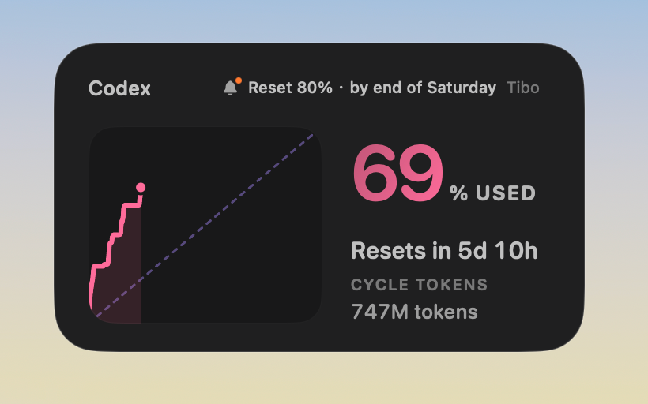
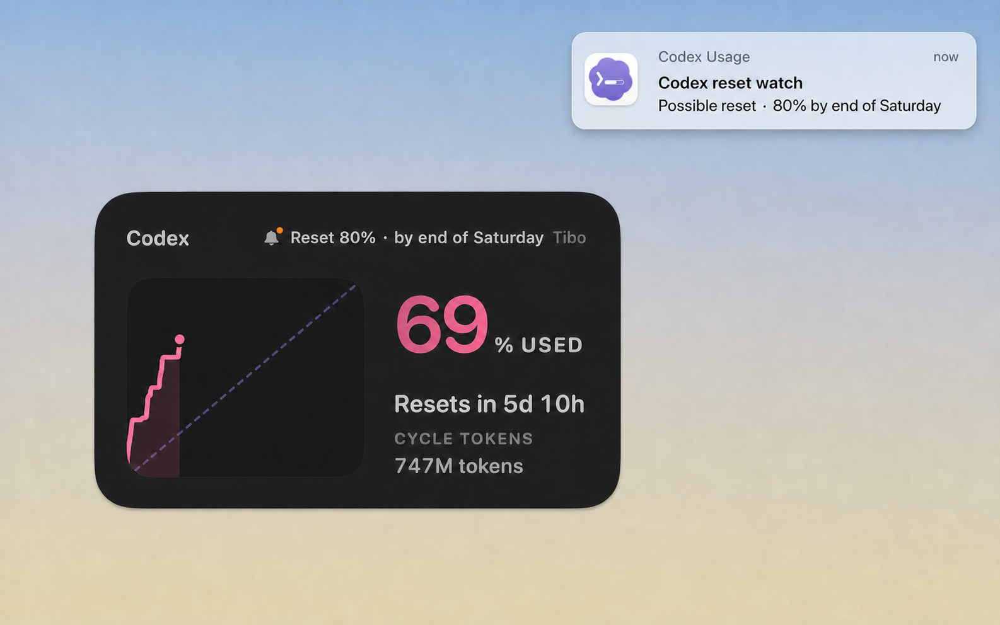

# Codex Usage

A standalone macOS 13+ SwiftUI app extracted from Dots. It provides:

- live Codex rolling-window quota and estimated current-cycle token usage;
- recent local Codex session and daily token summaries;
- a dashboard, menu bar status, and a movable, resizable desktop widget with
  palette controls;
- independent Reset Radar community signals and optional system notifications;
- an optional Work Trail using this Mac's approximate location.

## Widget



### Notification preview (mockup)

The banner mockup uses the app icon compiled from the current Icon Composer
source.



## Data sources and refresh

Codex usage refreshes at launch and once per minute. The local collector uses
the newest session JSONL found under `~/.codex/sessions` or
`~/.codex/archived_sessions` for the latest session summary. When reconstructing
the current rolling-window history, it may also read JSONL files modified during
that window and cache up to 360 quota changes locally.

If a local `codex` executable is available, the app starts
`codex app-server --stdio` and requests `account/rateLimits/read` and
`account/usage/read`. It does not read `~/.codex/auth.json` or send a synthetic
quota probe. Set `CODEX_EXECUTABLE` to override executable discovery; otherwise
the app checks `/opt/homebrew/bin`, `/usr/local/bin`, and `~/.local/bin`.

Reset Radar refreshes at most once every 30 minutes during automatic updates;
a manual refresh checks immediately. Its independent community data comes from
[`codex-resets.com`](https://codex-resets.com/api/v1/status) and
[`codexreset.org`](https://codexreset.org/), not from OpenAI account quota data.
The latest successful result is cached locally. Reset alerts are opt-in: enable
them from the Reset Radar card, use its Settings shortcut if macOS has disabled
notifications, and send a test alert after access is granted. Alerts can appear
as banners while the app is in the foreground.

Work Trail is off by default. When enabled, it requests macOS Location Services
access with approximately 100-meter target accuracy. Samples are stored in this
app's local preferences, retaining at most a 30-day span and 5,000 entries, and
can be cleared from the dashboard. Place names are resolved through the system
`CLGeocoder` service.

## App icon

The authoritative app icon source is the layered Icon Composer document at
`Resources/AppIcon/CodexUsage.icon`. Packaging compiles it with Xcode's asset
compiler into `Assets.car` and `CodexUsage.icns`. Legacy PNG/ICNS exports are
not tracked; regenerate them manually with `scripts/generate_app_icon.sh` if
needed. Normal packaging does not run that script.

## Build and test

```sh
swift build
swift test
```

## Build and launch a real app bundle

```sh
script/build_and_run.sh
script/build_and_run.sh verify
script/build_and_run.sh debug
script/build_and_run.sh logs
```

The default command packages and opens the app. `verify` also confirms that the
process launched, `debug` opens the packaged executable in LLDB, and `logs`
opens the app before streaming its unified logs.

The bundle is generated at `dist/Codex Usage.app` with bundle identifier
`app.codexusage.local`. Packaging prefers an available Developer ID Application
identity, then Apple Development, and otherwise falls back to ad-hoc signing.
